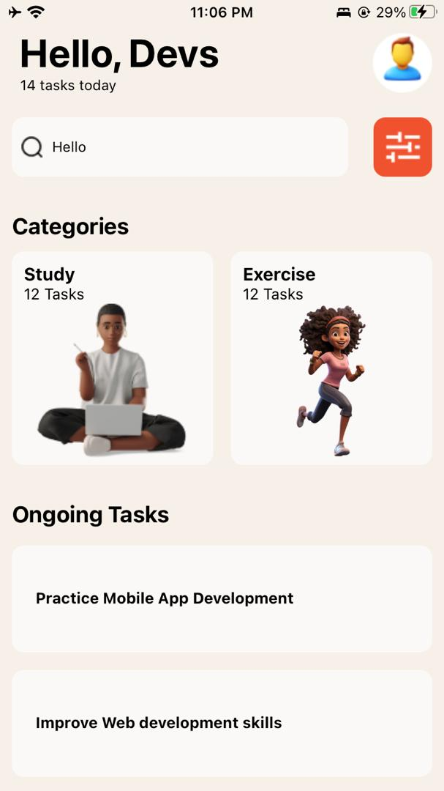
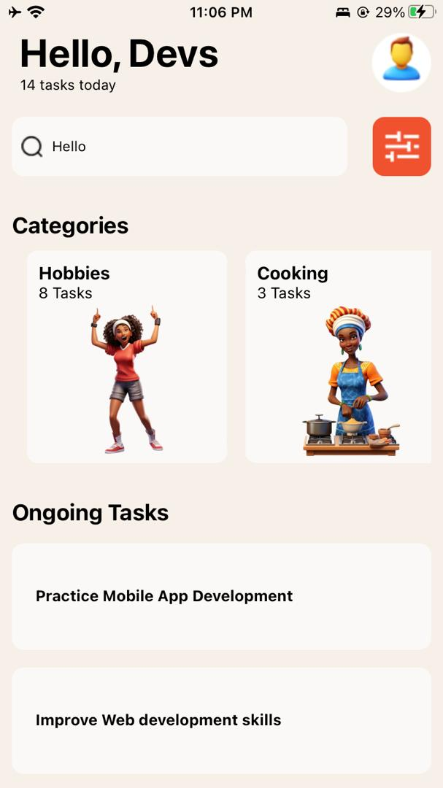
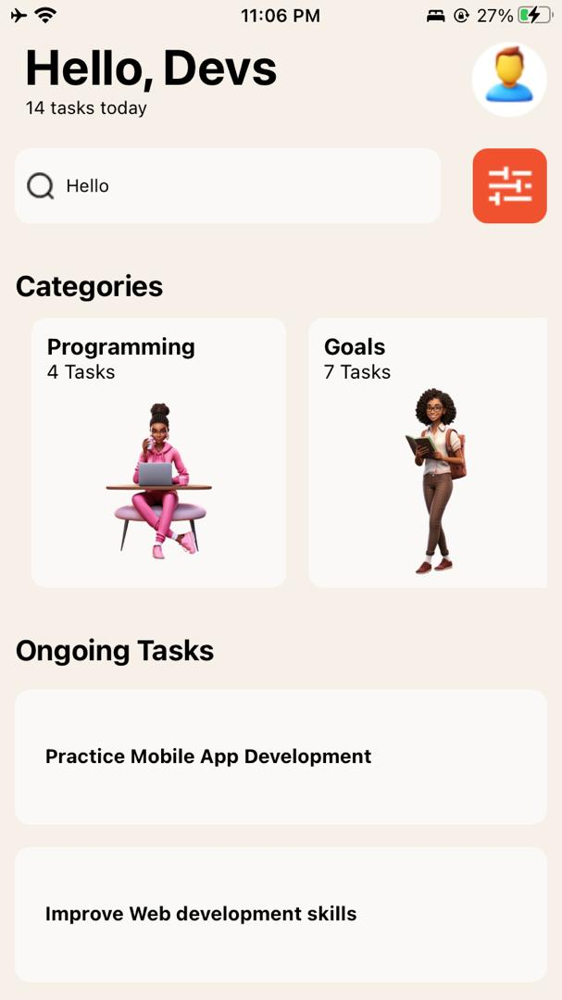
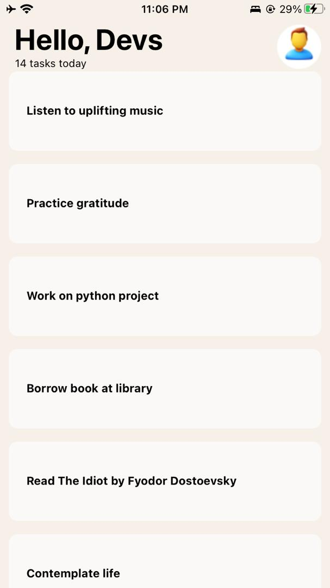

# React Native Application
## Student ID: 11014111
### Project Overview
This is a React Native application created using Expo CLI. It was created for my third assignment in Mobile Application Development. 

### What does this app do?
This app is a form of task management, or TO-DO application. 
The app was created using the UI found at [this link](https://www.figma.com/design/nk9YKIdz4RFypdwF9mtQTm/DCIT-202---Assignment-3?node-id=1-5&t=MJeOiPfQAvChwNdX-1) as reference. You can also find the figma file in this repository.

### Components and their usage
#### App.js

Description: The root component of the application. Sets up the main layout and renders other components.
Usage: Imports and utilizes custom components like Banner, SearchBox, TaskCategoriesList, etc.

#### Banner
Description: A component that displays a banner at the top of the screen.
Usage: ```import Banner from './components/banner/Banner'```

#### SearchBox
Description: A component containing a search bar with an icon.
Usage: ```import SearchBox from './components/search/SearchBox'```
Details: Uses TextInput for the search functionality, and Button for filtering search results.

#### TaskCategoriesList
Description: A component that renders a horizontal list of task categories.
Usage: ```import TaskCategoriesList from './components/taskCategories/TaskCategoriesList'```
Details: Utilizes FlatList to render TaskCategoryCard components.

#### TaskCategoryCard
Description: A component representing a single task category card.
Usage: ```import TaskCategoryCard from './components/taskCategories/TaskCategoryCard'```

#### OngoingTasks
Description: A component that renders a vertical list of ongoing tasks.
Usage: import OngoingTasks from './components/ongoingTasks/OngoingTasks'
Details: Utilizes FlatList to render individual task items.

#### Styles
Description: Separate stylesheets used to style each component.
Usage: Each component imports its specific styles from the styles folder.
Example: ```import { bannerStyles } from '../styles/bannerStyles';```

### Clone This Repository
- Open your terminal and navigate to the folder you want this repository to be cloned.
- Paste the following command
```
git clone https://github.com/favourrr-a/rn-assignment3-11014111.git
```
- Navigate to the project directory
```
cd rn-assignment3-11014111
```
### Screenshots Of The Application





